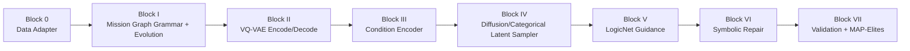
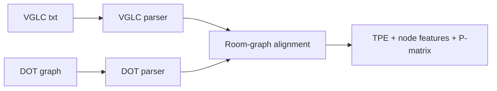
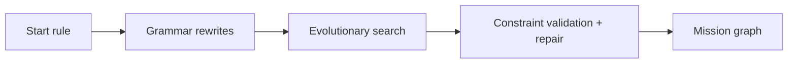
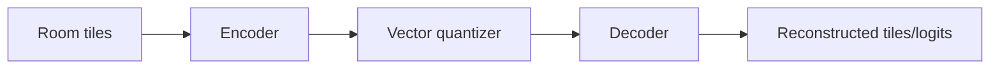
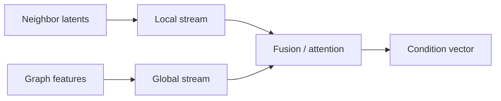
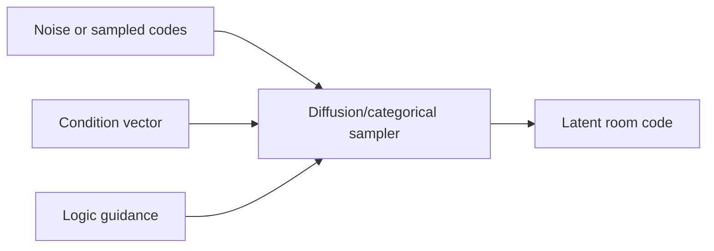
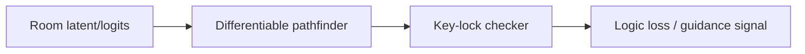
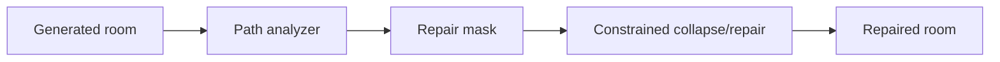
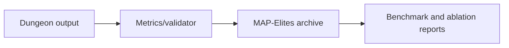

# Block-by-Block Architecture and Implementation Audit

Last updated: 2026-02-24

This document answers two questions from code-first evidence:
1. How each block works end-to-end.
2. Whether there are placeholders or unimplemented parts that are claimed as complete.

## 1. Canonical Block Map

Canonical runtime map from `src/__init__.py` and `src/pipeline/dungeon_pipeline.py`:

- Block 0: Data Adapter and corpus parsing/alignment
- Block I: Evolutionary topology generation (mission graph)
- Block II: VQ-VAE discrete representation
- Block III: Dual-stream condition encoder
- Block IV: Latent diffusion/categorical latent generation
- Block V: LogicNet differentiable guidance
- Block VI: Symbolic refiner / WFC-style repair
- Block VII: Evaluation and quality-diversity (MAP-Elites + validator)

## 2. Pipeline Diagram

## 3. Block Details

### Block 0: Data Adapter

Primary code paths:
- `src/data_processing/data_adapter.py`
- `src/data/zelda_core.py`

Block diagram:

What it does:
- Parses VGLC text rooms and DOT topology graphs.
- Aligns room slots to graph nodes.
- Extracts tensors/features (TPE, node features, P-matrix).

Core entrypoints:
- `IntelligentDataAdapter.load_dungeon(...)` in `src/data_processing/data_adapter.py`
- `ZeldaDungeonAdapter.load_dungeon(...)` in `src/data/zelda_core.py`

Output:
- Structured room tensors, graph, and alignment maps for downstream generation/validation.

Status:
- Implemented in runtime.
- Multiple adapter implementations exist (legacy + newer), so maintenance needs clear ownership to avoid drift.

### Block I: Mission Graph Generator

Primary code paths:
- `src/generation/grammar.py`
- `src/generation/evolutionary_director.py`

Block diagram:

What it does:
- Grammar rules construct progression graph (keys/locks/items/challenges).
- Evolutionary search optimizes rule sequences against target curve and solvability constraints.

Core entrypoints:
- `MissionGrammar.generate(...)` in `src/generation/grammar.py`
- `EvolutionaryTopologyGenerator.evolve(...)` in `src/generation/evolutionary_director.py`

Hard constraints:
- start/goal validity
- key/lock/item/token pre-gate reachability
- path feasibility

Soft objectives:
- tension/curve fit
- topology complexity/diversity

Status:
- Implemented and actively used.

### Block II: Semantic VQ-VAE

Primary code path:
- `src/core/vqvae.py`

Block diagram:

What it does:
- Encodes semantic rooms to latent codes.
- Quantizes latents via codebook (`VectorQuantizer`).
- Decodes back to tile logits.

Core entrypoints:
- `SemanticVQVAE.encode(...)`
- `SemanticVQVAE.decode(...)`

Status:
- Implemented.

### Block III: Dual-Stream Condition Encoder

Primary code path:
- `src/core/condition_encoder.py`

Block diagram:

What it does:
- Local stream: neighbor/boundary/position context.
- Global stream: graph structural context (torch_geometric or fallback GNN).
- Fuses both streams into conditioning vector.

Core entrypoint:
- `DualStreamConditionEncoder.forward(...)`

Status:
- Implemented.

### Block IV: Latent Generator (Diffusion/Categorical)

Primary code path:
- `src/core/latent_diffusion.py`
- Orchestrated by `src/pipeline/dungeon_pipeline.py`

Block diagram:

What it does:
- Diffusion sampling (`sample`, `ddim_sample`) in latent space.
- Optional categorical codebook path for ablation.

Core entrypoints:
- `LatentDiffusionModel.sample(...)`
- `LatentDiffusionModel.ddim_sample(...)`
- `LatentDiffusionModel.training_loss(...)`

Status:
- Implemented.

### Block V: LogicNet Guidance

Primary code path:
- `src/core/logic_net.py`

Block diagram:

What it does:
- Differentiable pathfinding/reachability approximations.
- Key-lock consistency penalties.
- Provides guidance signal to latent generation.

Core entrypoint:
- `LogicNet.forward(...)`

Status:
- Implemented.

### Block VI: Symbolic Repair

Primary code path:
- `src/core/symbolic_refiner.py`

Block diagram:

What it does:
- Detects local path failures and regenerates masked regions with symbolic constraints.
- Repairs room-level inconsistencies after neural generation.

Core entrypoints:
- `SymbolicRefiner.repair_room(...)`
- `SymbolicRefiner.repair_dungeon(...)`

Status:
- Implemented.

### Block VII: Evaluation + QD

Primary code paths:
- `src/simulation/map_elites.py` (runtime evaluator used by pipeline)
- `src/evaluation/benchmark_suite.py` (research benchmark protocol)
- `src/evaluation/map_elites.py` (richer archive utilities / feature extractors)

Block diagram:

What it does:
- Computes descriptor/quality metrics.
- Maintains MAP-Elites archive.
- Produces benchmark outputs including robustness and calibration payloads.

Core entrypoints:
- `MAPElitesEvaluator.add_dungeon(...)`
- `run_block_i_benchmark_from_scratch(...)`
- `audit_block0_dataset(...)`

Status:
- Implemented.

## 4. Placeholder / Unimplemented Audit

### 4.1 Runtime code audit (canonical blocks)

Result:
- No critical canonical block entrypoint is a placeholder.
- `raise NotImplementedError` occurrences found are abstract base contracts.

Observed patterns and classification:
- `src/evaluation/map_elites.py`: `FeatureExtractor.extract` -> abstract base method (intentional).
- `src/generation/grammar.py`: `ProductionRule.apply` -> abstract base method (intentional).
- `src/data/zelda_core.py`: some `__init__` methods use `pass` with no state (no-op, not missing implementation).
- Several `except Exception: pass` sites exist in runtime code (best-effort fallback), which are implemented but can hide failures if overused.

### 4.2 Claim vs code mismatch

Some documentation claims "zero placeholders", but codebase still contains:
- intentional abstract methods (`NotImplementedError`)
- no-op `pass` constructors
- broad `except ...: pass` fallback branches

These are not full missing implementations, but the "zero placeholders" wording is too absolute.

Files with absolute claims:
- `docs/MATHEMATICAL_RIGOR_COMPLETION_REPORT.md`
- `docs/THESIS_DEFENSE_IMPLEMENTATION_REPORT.md`

Recommendation:
- Replace "zero placeholders" with "no missing canonical runtime block implementations; abstract contracts and best-effort fallbacks remain."

## 5. Logic Fix Applied During Audit

File updated:
- `src/generation/entity_spawner.py`

Fixes:
- Aligned default tile IDs to canonical semantic palette (`FLOOR`, `WALL`, door tile IDs).
- Normalized room-type inference from mission graph node metadata/labels (`START/ENEMY/BOSS/...` to spawner room categories).
- Improved key-room inference from graph labels/types.

Why this mattered:
- Previous defaults used non-canonical tile IDs and could misclassify room types, producing weak or incorrect entity placement.

## 6. Remaining Engineering Risks (Not Placeholders)

- Duplicate/parallel implementations in some subsystems (data adapters, MAP-Elites variants) can reintroduce architecture drift.
- Broad `except Exception: pass` branches in critical modules reduce observability of failures.
- Documentation across older reports is inconsistent with canonical block numbering in some places.

## 7. Suggested Next Cleanup

1. Standardize one canonical module per block in docs index.
2. Replace broad exception-swallowing with logged scoped exceptions where possible.
3. Update older "complete/zero placeholder" reports to match current audited wording.
