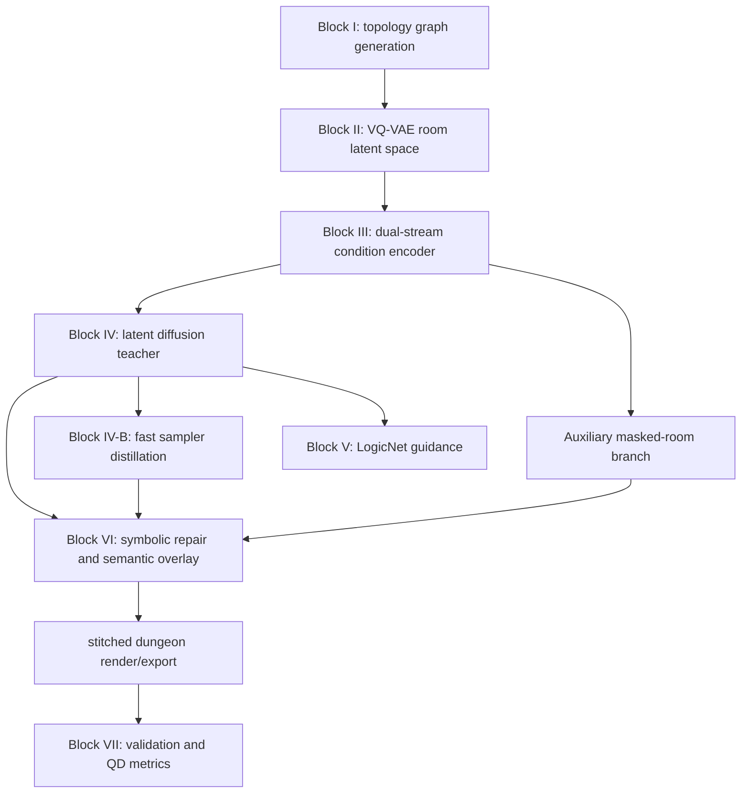
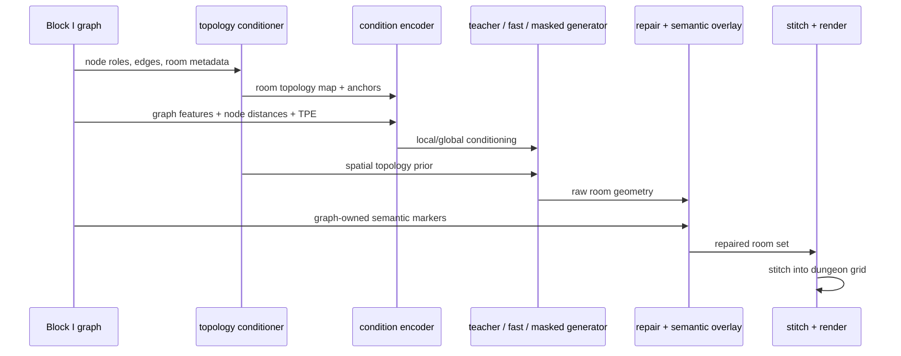

# Canonical Model Rationale, Ablation, And Complexity Guide

Last updated: 2026-04-15

This document is the canonical report-writing reference for the current Zelda
generation stack. It explains:

- why the current model is structured the way it is
- why the main hyperparameters and config values are set as they are
- how data flows through every block
- what each block contains internally
- what should be ablated, how to run each ablation, and what it would prove
- how the current model differs in complexity from older versions

Scope:

- canonical config: [`configs/zelda_hmolqd.yaml`](../configs/zelda_hmolqd.yaml)
- current topology-anchor policy in code: `2026-04-11.semantic_anchor_v8_puzzle_subtype_channels`
- canonical training entrypoint: `python main.py train --config configs/zelda_hmolqd.yaml ...`

Important note:

- this document explains the `design rationale`
- [`CURRENT_ARCHITECTURE.md`](CURRENT_ARCHITECTURE.md) owns the exact live
  implementation snapshot
- the latest VQ-VAE-2, LogicNet, repair, and ablation protocol is in
  [`VQVAE2_LOGICNET_REPAIR_ABLATION_PROTOCOL_2026_05_23.md`](VQVAE2_LOGICNET_REPAIR_ABLATION_PROTOCOL_2026_05_23.md)
- the older codebook512 downstream result snapshot is archived at
  [`archive/2026-q2/DOWNSTREAM_CODEBOOK512_PUZZLE_SUBTYPE_PROTOCOL_RESULTS_2026_04_15.md`](archive/2026-q2/DOWNSTREAM_CODEBOOK512_PUZZLE_SUBTYPE_PROTOCOL_RESULTS_2026_04_15.md)
- the canonical YAML still keeps a conservative `codebook_size=256`, while the
  latest downstream experiment used an explicit external `codebook512`
  checkpoint

This guide is intentionally detailed enough to support thesis/report writing.
It should be read together with:

- [`CURRENT_ARCHITECTURE.md`](CURRENT_ARCHITECTURE.md)
- [`BLOCK_IO_REFERENCE.md`](BLOCK_IO_REFERENCE.md)
- [`archive/2026-q2/ARCHITECTURE_RESEARCH_AUDIT_2026_03_31.md`](archive/2026-q2/ARCHITECTURE_RESEARCH_AUDIT_2026_03_31.md)
- [`archive/2026-q2/ARCHITECTURE_RESEARCH_AUDIT_TOPOLOGY_SIGNAL_2026_04_04.md`](archive/2026-q2/ARCHITECTURE_RESEARCH_AUDIT_TOPOLOGY_SIGNAL_2026_04_04.md)

## 1. Executive Summary

The current model is best described as a `hybrid neural-symbolic dungeon
generator` with a `graph-first` control policy.

It is not a single monolithic network. Instead, it is a staged architecture:

1. `Block I` generates a dungeon topology graph.
2. `Block II` compresses room layouts into a discrete latent space with VQ-VAE.
3. `Block III` encodes graph context and local room context.
4. `Block IV` generates room latents with a diffusion teacher.
5. `Block IV-B` distills a faster few-step sampler from the diffusion teacher.
6. The masked-room branch provides a discrete auxiliary room generator.
7. `Block V` provides LogicNet guidance and differentiable validity pressure.
8. `Block VI` repairs invalid structure and overlays graph-owned semantics.
9. `Block VII` evaluates solvability, behavior, and quality-diversity metrics.

This factorization was chosen because the Zelda corpus is small. Literature on
structured generation and game-PCG consistently suggests that when data is
limited, it is safer to separate:

- high-level mission/topology control
- room geometry generation
- exact gameplay-semantic placement

than to force one end-to-end neural model to learn everything at once.

The most important design decision is therefore not any single layer. It is the
`division of responsibility`:

- topology and progression live in the graph
- room geometry lives mainly in the neural generator
- mission-critical markers are reimposed symbolically when correctness matters

That is why the current system is more controllable and robust than a purely
neural baseline, even if it is also less "fully neural" in a strict sense.

## 2. Research Foundation

The main architectural choices are backed by the following primary sources.

| Topic | Paper | Venue | Why it supports this architecture |
|---|---|---|---|
| Discrete latent compression | van den Oord et al., *Neural Discrete Representation Learning* | NeurIPS 2017 | Justifies VQ-VAE as a structured discrete latent bottleneck rather than a plain autoencoder. |
| Coordinate awareness | Liu et al., *An Intriguing Failing of Convolutional Neural Networks and the CoordConv Solution* | NeurIPS 2018 | Supports using `CoordConv` in the room encoder to stabilize positional learning on small fixed grids. |
| Diffusion foundations | Ho et al., *Denoising Diffusion Probabilistic Models* | NeurIPS 2020 | Base diffusion formulation for the teacher branch. |
| Deterministic fast sampling | Song et al., *Denoising Diffusion Implicit Models* | ICLR 2021 | Supports DDIM-style deterministic sampling and the speed-quality tradeoff. |
| Latent-space diffusion | Rombach et al., *High-Resolution Image Synthesis with Latent Diffusion Models* | CVPR 2022 | Strong justification for generating in latent space rather than directly over room tiles. |
| Guidance | Ho and Salimans, *Classifier-Free Diffusion Guidance* | arXiv / NeurIPS workshop era 2022 | Supports conditional dropout in training and controlled CFG at inference. |
| Min-SNR weighting | Hang et al., *Efficient Diffusion Training via Min-SNR Weighting Strategy* | ICCV 2023 | Supports `min_snr_gamma=5.0` as a practical diffusion-stability default. |
| Few-step distillation | Luo et al., *Latent Consistency Models* | arXiv 2023 | Supports the logic of a few-step distilled sampler rather than always using the full teacher. |
| Parallel masked generation | Chang et al., *MaskGIT: Masked Generative Image Transformer* | CVPR 2022 | Strong analogue for the masked-room branch and its iterative masked-token decoding. |
| Structured graph-to-layout generation | Hu et al., *Graph2Plan* | CVPR 2020 | Supports graph-first layout generation rather than unconditional room synthesis. |
| Graph-conditioned diffusion layouts | Shabani et al., *HouseDiffusion* | CVPR 2023 | Supports graph-aware structured generation and explicit layout constraints. |
| General graph transformers | Rampasek et al., *Recipe for a General, Powerful, Scalable Graph Transformer* | NeurIPS 2022 workshop-era graph literature | Supports the `gps` condition encoder in the main diffusion path. |
| Spatial semantic modulation | Park et al., *Semantic Image Synthesis with Spatially-Adaptive Normalization* | CVPR 2019 | Supports `SPADE`-style topology conditioning instead of a weak additive bias. |
| Low-data PCG difficulty | Rodriguez Torrado et al., *Bootstrapping Conditional GANs for Video Game Level Generation* | IEEE CoG 2019 | Supports keeping symbolic constraints and repair around the learned model in a limited-data game setting. |

### Key takeaways from the literature

1. `Latent diffusion is the right efficiency bias`.
   Latent Diffusion shows that moving generation into a compressed latent space
   preserves controllability while reducing cost compared with pixel-space
   diffusion. That directly motivates the VQ-VAE plus latent diffusion split.

2. `CFG is useful but fragile`.
   Classifier-Free Guidance improves conditional fidelity, but it is explicitly a
   tradeoff between fidelity and diversity. This is why the repo now keeps the
   runtime teacher regime aligned with the trained value `cfg_scale=3.0` instead
   of using an arbitrarily larger default.

3. `SPADE-style conditioning is stronger than a weak additive prior when the
   conditioning map is meaningful`.
   The topology map is spatial. Therefore, spatial modulation is more natural
   than simply adding a broadcast tensor.

4. `Few-step students inherit teacher limits`.
   LCM-style students are only as good as the teacher target and inference
   alignment. Fast-sampler quality problems should therefore be interpreted
   mainly as teacher-quality or regime-alignment problems, not as proof that
   few-step sampling is fundamentally wrong.

5. `Low-data game generation needs extra structure`.
   The game-PCG literature supports the decision to keep topology generation,
   semantic anchors, symbolic repair, and graph-owned marker placement explicit.

## 3. Overall Architecture

### 3.1 Canonical pipeline



### 3.2 Canonical blocks and responsibilities

| Block | Main file(s) | Responsibility | Output |
|---|---|---|---|
| Block I | `src/generation/*`, `src/utils/graph_utils.py` | Generate or validate a mission/topology graph | room graph with mission semantics |
| Block II | [`src/core/vqvae.py`](../src/core/vqvae.py) | Compress room tensors into discrete latents | latent room codes |
| Block III | [`src/core/condition_encoder.py`](../src/core/condition_encoder.py) | Encode graph context, local context, and reference rooms | conditioning tokens/features |
| Block IV | [`src/core/latent_diffusion.py`](../src/core/latent_diffusion.py) | Generate room latents under graph/topology conditioning | latent room sample |
| Block IV-B | [`src/train_lcm.py`](../src/train_lcm.py), [`src/optimization/lcm_lora.py`](../src/optimization/lcm_lora.py) | Distill a few-step fast sampler from the teacher | LoRA student adapters |
| Auxiliary | [`src/core/discrete_masked_model.py`](../src/core/discrete_masked_model.py), [`src/train_masked_room.py`](../src/train_masked_room.py) | Parallel discrete alternative room generator | discrete room tokens |
| Block V | [`src/core/logic_net.py`](../src/core/logic_net.py), [`src/core/latent_diffusion.py`](../src/core/latent_diffusion.py) | Differentiable logic guidance and validity pressure | logic losses / guidance gradients |
| Block VI | [`src/pipeline/dungeon_pipeline.py`](../src/pipeline/dungeon_pipeline.py), `src/pipeline/room_stitching.py` | Repair, marker placement, stitching, export | full dungeon grid |
| Block VII | `src/evaluation/*`, `src/simulation/*` | Mechanical validation, P-CBS, and QD metrics | reports / metrics |

## 4. Detailed Block-By-Block Analysis

## 4.1 Block I - Topology Graph Generation

### What it does

Block I generates or validates the dungeon mission graph: start room, lock/key
structure, boss path, reward path, side branches, and final goal.

### Why this block exists

The repo does not ask the room generator to invent global mission structure
implicitly. That is intentional. `Graph2Plan` and `HouseDiffusion` both support
the idea that structured generation improves when the graph contract is explicit
before geometry is synthesized.

### Why it is placed first

Every downstream stage depends on knowing:

- which room is the start
- which room is a boss room
- which room should contain the goal/triforce
- which doors and room adjacencies must exist

If topology came later, the room model would have to solve progression and
geometry simultaneously, which is exactly the unstable regime we are trying to
avoid on a tiny dataset.

### Data flow

`mission graph -> node roles + edges + anchors -> room order -> conditioning`

### Why not replace it with a single neural model

Because on this corpus that would create three simultaneous burdens:

- learning topology
- learning room geometry
- learning progression semantics

That is a much harder problem than the available data supports.

## 4.2 Block II - Semantic VQ-VAE

### What it contains

Main implementation:

- [`SemanticVQVAE`](../src/core/vqvae.py)
- encoder CNN
- codebook / vector quantizer
- decoder CNN
- optional `CoordConv`
- illegal-adjacency penalty during training

### What it does

It maps a room tensor from the fixed Zelda tile grid into a discrete latent
representation and then reconstructs the room from that compressed space.

### Why choose VQ-VAE

Why `VQ-VAE` instead of a plain autoencoder or a continuous VAE:

1. The room domain is inherently discrete.
2. The downstream generator benefits from a compressed but still structured
   latent representation.
3. The codebook forces a vocabulary-like latent space, which is often a better
   fit for symbolic layouts than unconstrained continuous features.

This is directly aligned with van den Oord et al.

### Why it is placed before diffusion

Because latent diffusion is much cheaper than operating on the raw `16x11`
semantic grid.

Current room sizes:

- raw room grid: `16 x 11 = 176` cells
- VQ latent grid used downstream: `4 x 3 = 12` latent positions

That token compression is the main reason latent diffusion is practical here.

### Current canonical VQ-VAE design choices

| Hyperparameter | Value | Why |
|---|---:|---|
| `vqvae.hidden_dim` | `96` | Reduced from older wider settings to lower small-data overfitting risk while keeping enough reconstruction capacity. |
| `vqvae.codebook_size` | `256` | Large enough to preserve room diversity, small enough to avoid dead-code churn on a tiny corpus. |
| `vqvae.latent_dim` | `64` | Strong enough latent width for the teacher and condition encoder, but still compact. |
| `vqvae.use_coordconv` | `true` | Room generation is highly position-sensitive; CoordConv helps fixed-grid coordinate learning. |
| `vqvae.mrf_penalty_weight` | `0.05` | Adds light structural pressure against illegal local tile adjacencies. |

### Why not increase VQ-VAE again

The earlier architecture audit recorded an older VQ-VAE at about `31.10M`
parameters. The current canonical VQ-VAE is about `17.62M`. On this dataset,
the smaller model is the better tradeoff because VQ-VAE is only a
representation stage, not the final semantic controller.

## 4.3 Block III - Dual-Stream Condition Encoder

### What it contains

Main implementation:

- [`DualStreamConditionEncoder`](../src/core/condition_encoder.py)
- `LocalStreamEncoder`
- `GlobalStreamEncoder`
- optional reference-room-map encoder
- cross-attention fusion between local and global streams

### What it does

It converts:

- graph node features
- graph edge features
- topological positional encodings
- current-node distance features
- neighbor/reference room maps

into conditioning features consumed by the room generator.

### Why two streams

Because the room generator needs two qualitatively different kinds of context:

1. `Global context`
   progression role, graph position, long-range structure
2. `Local context`
   what neighboring rooms or nearby structures look like

Merging them too early loses this separation. Keeping them separate and then
fusing them is more expressive.

### Why `gps` for diffusion but `gcn` for masked-room

Current canonical choice:

- diffusion conditioner: `gps`
- masked-room conditioner: `gcn`

Reason:

- the diffusion branch is the main quality path, so it uses the stronger graph
  backbone
- the masked-room branch already operates at full room resolution, so it is
  computationally heavier on the token side and more exposed to small-data
  overfitting
- using a lighter graph encoder there is a deliberate cost-control decision

### Why reference-room maps are enabled

Current canonical choice:

- `condition_use_reference_room_maps = true` in both diffusion and masked-room

Reason:

- on a small dataset, neighboring room exemplars give the model a cheap local
  structural prior
- this helps continuity across room boundaries without needing a much larger
  generator

## 4.4 Block IV - Diffusion Teacher

### What it contains

Main implementation:

- [`LatentDiffusionModel`](../src/core/latent_diffusion.py)
- U-Net denoiser
- self-attention and cross-attention
- topology conditioning path
- DDPM/DDIM samplers
- classifier-free guidance support
- Min-SNR training reweighting

### What it does

It generates room latents conditioned on:

- graph/global context from Block III
- room-topology maps
- optional LogicNet pressure

### Why diffusion

Why diffusion instead of GAN-only or pure autoregressive room synthesis:

1. diffusion is robust under complicated conditioning
2. latent diffusion is cheaper than raw tile diffusion
3. diffusion gives a clean teacher target for fast-sampler distillation

### Why `SPADE` topology conditioning in diffusion

Current canonical choice:

- `diffusion.topology_conditioning_mode = spade`

Reason:

- room topology is spatial, not just categorical
- `SPADE`-style modulation can inject "where" information more strongly than a
  simple additive tensor
- this is especially useful when start, goal, key, boss, and puzzle anchors are
  localized in the topology map

### Why the diffusion teacher is still the main quality path

Because it has:

- the strongest graph conditioner
- the most expressive generative process
- the cleanest training objective

The fast sampler and masked-room branch both exist partly to trade off against
the teacher, not to replace it as the default highest-fidelity path.

### Current canonical diffusion choices

| Hyperparameter | Value | Why |
|---|---:|---|
| `diffusion.model_channels` | `96` | Main capacity knob for the teacher. Large enough for quality, smaller than an unnecessarily overbuilt teacher. |
| `diffusion.context_dim` | `256` | Enough room for graph tokens, local features, and spatial priors to coexist. |
| `diffusion.condition_hidden_dim` | `192` | Reduced from older wider profiles to lower overfitting risk while keeping graph expressivity. |
| `diffusion.condition_num_gnn_layers` | `2` | Avoids excessive graph smoothing and unnecessary compute on small room graphs. |
| `diffusion.condition_gnn_type` | `gps` | Better local-global graph processing than plain GCN for the main quality path. |
| `diffusion.condition_use_reference_room_maps` | `true` | Gives the model cheap local neighborhood context. |
| `diffusion.num_timesteps` | `1000` | Standard teacher schedule resolution; compatible with DDIM-style subsampling at inference. |
| `diffusion.schedule_type` | `cosine` | Stable modern default for diffusion schedules. |
| `diffusion.cfg_scale` | `3.0` | Matches the trained teacher regime; prevents the earlier runtime mismatch problem. |
| `diffusion.min_snr_gamma` | `5.0` | Directly supported by Min-SNR literature as a strong default. |
| `diffusion.alpha_logic` | `0.1` | Logic should regularize, not dominate denoising. |
| `diffusion.warmup_epochs` | `5` | Prevents logic loss from destabilizing early denoising learning. |
| `diffusion.validation_num_samples` | `8` | Enough generated samples to track structure/logic trends cheaply. |
| `diffusion.validation_num_diffusion_samples` | `64` | Larger real-latent validation set stabilizes teacher selection. |

### Why the teacher checkpoint is selected by a balanced validation objective

The repo no longer treats logic-only improvement as enough to define the best
teacher. That is because teacher quality must balance:

- denoising quality
- logic/solvability alignment

If logic dominates checkpoint selection, room visuals can regress even while
logic metrics look better. This was a real failure mode the repo already had to
correct.

## 4.5 Block IV-B - Fast Sampler

### What it contains

Main implementation:

- [`train_lcm.py`](../src/train_lcm.py)
- [`lcm_lora.py`](../src/optimization/lcm_lora.py)
- LoRA adapters on the teacher denoiser

### What it does

It distills the diffusion teacher into a few-step sampler.

### Why this block exists

The full teacher is expensive because it repeats denoising many times. The fast
sampler exists to reduce inference latency while staying close to the teacher.

### Why it comes after teacher training

Because it does not learn from the dataset alone. It learns from the teacher.

### Why `10` epochs is not necessarily wrong

The fast sampler is not a full generative model trained from scratch. It is a
distillation stage. That is why its default `epochs=10` is much smaller than
the diffusion or masked-room training budget.

### Current canonical fast-sampler choices

| Hyperparameter | Value | Why |
|---|---:|---|
| `fast_sampler.epochs` | `10` | Short distillation stage by design; extend only if teacher mismatch remains. |
| `fast_sampler.num_inference_steps` | `4` | Main speed target for the student. |
| `fast_sampler.lora_rank` | `8` | Keeps student lightweight while allowing meaningful adaptation. |
| `fast_sampler.lora_alpha` | `8.0` | Standard low-rank scaling choice matched to rank. |
| `generation.fast_sampler_teacher_fallback_enabled` | `true` | Prevents obviously bad student rooms from degrading the final dungeon. |

### Why the fallback exists

Because a speed-up layer should not be allowed to silently lower overall system
quality when the teacher is available. The fallback is therefore a practical
quality guard, not a theoretical ideal.

## 4.6 Auxiliary Branch - Masked-Room Generator

### What it contains

Main implementation:

- [`DiscreteMaskedRoomModel`](../src/core/discrete_masked_model.py)
- U-Net-like token refinement stack
- topology-derived fixed-token mask
- graph condition encoder

### What it does

It masks part of a room and predicts the missing semantic tiles in iterative
parallel refinement steps.

### Why keep this branch

It serves three purposes:

1. an alternative generation path
2. a discrete ablation against the diffusion teacher
3. a stronger path when token-level semantic anchoring matters more than latent
   photorealism-like synthesis

### Why it was downsized so aggressively

Earlier audits measured an oversized masked-room setup at about `65.78M`
parameters. The current canonical masked-room stack is about `12.45M` total.

This is intentional because:

- it works on the full `16x11 = 176` cell room grid, not the `12`-token latent
  grid
- full-resolution token interaction is inherently much more expensive
- the Zelda corpus is too small to justify a near-teacher-sized masked model

### Current canonical masked-room choices

| Hyperparameter | Value | Why |
|---|---:|---|
| `masked_room.model_channels` | `64` | Keeps the auxiliary branch under the small-data danger zone. |
| `masked_room.hidden_dim` | `48` | Enough semantic token width for room semantics without approaching teacher-scale cost. |
| `masked_room.unet_channel_mult` | `[1,2]` | Shallower than diffusion because it already runs at full spatial resolution. |
| `masked_room.unet_num_res_blocks` | `1` | Avoids unnecessary depth on a tiny dataset. |
| `masked_room.unet_num_heads` | `4` | Sufficient for token interactions at this scale. |
| `masked_room.masked_steps` | `8` | Enough iterative refinement without becoming too slow. |
| `masked_room.min_mask_ratio` | `0.12` | Prevents trivial identity training. |
| `masked_room.max_mask_ratio` | `0.85` | Forces completion behavior under difficult masks without making the task impossible. |
| `masked_room.topology_conditioning_mode` | `additive` | Cheaper than SPADE and adequate for the smaller auxiliary branch. |
| `masked_room.condition_gnn_type` | `gcn` | Cheaper graph backbone, appropriate for the auxiliary path. |

### Why semantic anchors matter more here than before

The masked-room branch now freezes topology-derived semantic anchors during
training, not only doors/start/goal. This change closes the train/runtime gap
between:

- what topology communicates
- what the branch is required to preserve

That is one of the most important recent architectural improvements.

## 4.7 Block VI - Symbolic Repair And Graph-Owned Semantics

### What it does

This stage:

- repairs invalid geometry
- enforces room boundary and door consistency
- re-overlays graph-owned semantics such as start, goal, boss, keys, stairs,
  and puzzle markers

### Why it exists

Because the architecture prioritizes correctness and controllability over a
fully end-to-end claim.

### Why it is placed at the end

Because semantic markers and repair should operate on the final room geometry,
not on intermediate latent or masked-token states.

### What the model does not fully own

The following are still intentionally controlled by the graph/pipeline when
correctness matters:

- start placement
- triforce placement
- some item semantics
- some puzzle/stair semantics

This is not a hidden bug. It is a deliberate design tradeoff motivated by the
small-data setting.

## 5. End-To-End Data Flow

## 5.1 Inference pipeline



## 5.2 Training pipeline by stage

### Stage 1 - VQ-VAE

Input:

- room tensor only

Output:

- discrete latent room space

Why training is independent:

- VQ-VAE does not consume graph or topology conditioning
- therefore semantic-anchor updates do `not` require VQ-VAE retraining

### Stage 2 - Diffusion teacher

Input:

- frozen VQ-VAE latents
- graph conditioning
- topology conditioning
- optional LogicNet loss

Output:

- best diffusion teacher checkpoint

### Stage 3 - Fast sampler

Input:

- best diffusion teacher

Output:

- LoRA student adapters for fast few-step inference

### Stage 4 - Masked-room

Input:

- room tokens
- graph conditioning
- topology conditioning
- topology-derived fixed semantic anchors

Output:

- discrete masked-room checkpoint

## 6. Why The Configuration Looks Like This

This section focuses on `architecturally meaningful` hyperparameters. Logging,
filesystem, and generic optimizer boilerplate are omitted unless they affect the
scientific behavior of the model.

## 6.1 VQ-VAE config rationale

| Parameter | Current value | Rationale |
|---|---:|---|
| `vqvae.hidden_dim` | `96` | The repo already observed that wider room autoencoders raise capacity quickly without guaranteeing better downstream generation. `96` is a balanced width. |
| `vqvae.codebook_size` | `256` | Small enough to avoid severe dead-code churn, large enough to keep useful room-token diversity. |
| `vqvae.latent_dim` | `64` | Keeps the latent expressive enough for diffusion and LogicNet while still strongly compressed. |
| `vqvae.use_coordconv` | `true` | Zelda rooms are position-sensitive. CoordConv is a targeted positional inductive bias for fixed grids. |
| `vqvae.mrf_penalty_weight` | `0.05` | Prevents reconstruction from drifting into locally illegal tile adjacencies without overpowering the main reconstruction objective. |

## 6.2 Diffusion config rationale

| Parameter | Current value | Rationale |
|---|---:|---|
| `diffusion.model_channels` | `96` | Main capacity knob for the teacher. Large enough for quality, smaller than an unnecessarily overbuilt teacher. |
| `diffusion.context_dim` | `256` | Enough room for graph tokens, local features, and spatial priors to coexist. |
| `diffusion.condition_hidden_dim` | `192` | Reduced from older wider profiles to lower overfitting risk while keeping graph expressivity. |
| `diffusion.condition_num_gnn_layers` | `2` | Avoids excessive graph smoothing and unnecessary compute on small room graphs. |
| `diffusion.condition_gnn_type` | `gps` | Better local-global graph processing than plain GCN for the main quality path. |
| `diffusion.condition_use_reference_room_maps` | `true` | Gives the model cheap local neighborhood context. |
| `diffusion.num_timesteps` | `1000` | Standard teacher schedule resolution; compatible with DDIM-style subsampling at inference. |
| `diffusion.schedule_type` | `cosine` | Stable modern default for diffusion schedules. |
| `diffusion.cfg_scale` | `3.0` | Matches the trained teacher regime; prevents the earlier runtime mismatch problem. |
| `diffusion.min_snr_gamma` | `5.0` | Directly supported by Min-SNR literature as a strong default. |
| `diffusion.alpha_logic` | `0.1` | Logic should regularize, not dominate denoising. |
| `diffusion.warmup_epochs` | `5` | Prevents logic loss from destabilizing early denoising learning. |
| `diffusion.validation_num_samples` | `8` | Enough generated samples to track structure/logic trends cheaply. |
| `diffusion.validation_num_diffusion_samples` | `64` | Larger real-latent validation set stabilizes teacher selection. |

## 6.3 Generation/topology-anchor config rationale

| Parameter | Current value | Rationale |
|---|---:|---|
| `generation.guidance_scale` | `3.0` | Runtime must match the teacher’s trained CFG regime. |
| `generation.logic_guidance_scale` | `0.0` | Extra inference-time gradient guidance is kept opt-in, because it is easy to overuse and distort results. |
| `generation.semantic_role_prior_strength` | `0.15` | A light room-wide semantic prior helps the model without washing out localized anchors. |
| `generation.semantic_anchor_threshold` | `0.5` | Reasonable midpoint for turning topology channels into fixed semantic anchors in masked-room training/ablation. |
| `generation.semantic_puzzle_offset` | `2` | Keeps puzzle anchors away from exact central collision with other semantic markers. |
| `generation.fast_sampler_teacher_fallback_enabled` | `true` | A practical quality guard to protect the pipeline from suspicious low-step rooms. |

## 6.4 Masked-room config rationale

| Parameter | Current value | Rationale |
|---|---:|---|
| `masked_room.model_channels` | `64` | Keeps the auxiliary branch in a safer small-data capacity regime. |
| `masked_room.hidden_dim` | `48` | Enough semantic token width without approaching teacher-scale cost. |
| `masked_room.condition_hidden_dim` | `192` | Matches the diffusion conditioner width policy closely enough for reuse, but still respects the smaller branch. |
| `masked_room.condition_gnn_type` | `gcn` | Lightweight graph encoder to control cost at full room resolution. |
| `masked_room.topology_conditioning_mode` | `additive` | Cheaper than SPADE and acceptable for the auxiliary branch. |
| `masked_room.min_mask_ratio` | `0.12` | Avoids trivial near-copy tasks. |
| `masked_room.max_mask_ratio` | `0.85` | Forces completion behavior under difficult masks without making the task impossible. |
| `masked_room.epochs` | `100` | The masked-room branch needs a longer training horizon than the fast sampler because it is learned directly from data, not distilled. |

## 7. Integration And Exclusion Mechanisms

This section answers the question: `How does the architecture combine useful
information and exclude harmful or redundant information?`

| Mechanism | Where | Why it is there | What it excludes / controls |
|---|---|---|---|
| Classifier-free dropout | Diffusion teacher training | Teaches both conditional and unconditional denoising for CFG | Overdependence on conditioning |
| Cross-attention | Diffusion U-Net and Block III fusion | Lets the generator query graph/local context selectively | Blind concatenation of all context |
| `SPADE` topology modulation | Diffusion teacher | Injects spatial role/anchor information exactly where it matters | Weak global-only topology use |
| Reference-room maps | Block III | Adds local exemplar context | Purely graph-level conditioning only |
| Fixed semantic anchors | Masked-room branch | Forces preservation of mission-critical topology semantics | Drift of key/start/goal/boss semantics |
| Teacher fallback | Runtime fast-sampler path | Preserves quality when the few-step student is suspicious | Silent degradation from fast inference |
| Symbolic repair | Post-generation | Restores boundary/door/playability validity | Invalid geometry left by the generator |
| Graph-owned marker overlay | Post-generation | Guarantees mission-critical semantics remain correct | Unreliable purely learned semantic placement |

## 8. Model Complexity

## 8.1 Measured current parameter counts

Measured from the live canonical config on 2026-04-06:

| Component | Trainable parameters |
|---|---:|
| VQ-VAE | `17,623,948` |
| Diffusion denoiser | `66,599,302` |
| Diffusion condition encoder | `3,206,961` |
| LogicNet | `274,957` |
| Teacher total | `70,081,220` |
| Masked-room model | `10,502,534` |
| Masked-room condition encoder | `1,946,289` |
| Masked-room total | `12,448,823` |

## 8.2 Old vs new complexity

From earlier architecture audits:

| Component | Older audit value | Current canonical value | Change |
|---|---:|---:|---:|
| VQ-VAE | `31.10M` | `17.62M` | lower |
| Masked-room total | `65.78M` | `12.45M` | much lower |

### Why the new model is cheaper in those branches

Because the repo intentionally reduced:

- width
- branch depth
- attention footprint

in the places where small-data overfitting was highest.

### Why the teacher is still expensive

Because the quality path still depends on:

- a large denoiser
- repeated denoising over many steps
- a rich condition encoder

That is a deliberate choice. The teacher is the high-fidelity branch.

## 8.3 Token and spatial complexity intuition

Two scales matter:

- raw room grid: `16 x 11 = 176` cells
- VQ latent grid: `4 x 3 = 12` tokens

This means:

- token count ratio: `176 / 12 ≈ 14.7x`
- pairwise attention interaction ratio: `176^2 / 12^2 ≈ 215x`

That is the most important complexity fact in the whole system.

It explains why:

- latent diffusion can afford a bigger teacher
- masked-room must be much smaller even though it feels "simpler"

because masked-room operates at much higher spatial resolution.

## 8.4 Big-O complexity by block

Let:

- `H, W` be spatial size
- `C` be channel width
- `k` be kernel size
- `N` be graph node count
- `E` be graph edge count
- `d` be hidden width
- `T` be number of diffusion steps

Then:

### VQ-VAE

Per forward pass:

- convolutional cost: `O(H W k^2 C_in C_out)`
- total encoder/decoder cost: approximately the sum over all conv blocks

### Condition encoder

Graph message passing:

- `O(L_g E d^2)` for `L_g` GNN layers in a simplified dense-matrix view

Global graph attention in GPS-style components:

- `O(N^2 d)`

Reference-room local encoding:

- approximately `O(H W d)`

### Diffusion teacher

Per step:

- U-Net conv stack: `O(sum_l H_l W_l k^2 C_l^2)`
- attention blocks: `O(sum_l n_l^2 d_l)` where `n_l = H_l W_l`

Full teacher sampling:

- multiply by `T = generation.num_diffusion_steps`

So total teacher inference is approximately:

- `O(T * (U-Net + attention + conditioning))`

### Fast sampler

Same per-step structure as the teacher, but with:

- `T_fast = 4`

Therefore the main theoretical speedup is step-count reduction:

- approximately `50 / 4 = 12.5x` relative to the canonical `50`-step teacher,
  before fallback overhead

### Masked-room branch

Iterative refinement over the full room grid:

- `O(S * (full-resolution U-Net + attention))`

where `S = masked_steps`.

This can still be expensive even when parameter count is small, because it runs
on `176` spatial positions rather than the latent `12` positions.

## 8.5 FLOPs and wall-clock interpretation

Exact FLOPs depend on batch size and implementation details, but the relative
story is stable:

1. `Teacher diffusion` is expensive because it repeats a strong denoiser many
   times.
2. `Fast sampler` reduces wall-clock mainly by reducing denoising steps.
3. `Masked-room` is parameter-light but not automatically cheap because it runs
   at full room resolution.

### Why complexity is better in some places and worse in others

The current model is:

- `better` than older versions in small-data risk and auxiliary-branch cost
- `worse` than a single tiny baseline in absolute system complexity

That is acceptable because the architecture is optimizing for:

- structured controllability
- semantic correctness
- playable outputs

not just minimum parameter count.

## 9. Ablation Study Plan

The commands below are intentionally provided as CLI commands only. They are not
run automatically here.

## 9.1 Ablation A - Diffusion topology conditioning: `SPADE` vs `additive`

### Hypothesis

`SPADE` should use localized topology signals better than pure additive
conditioning.

### What it proves

Whether spatial modulation is genuinely helping the teacher use topology.

### Commands

```powershell
python main.py train `
  --config configs\zelda_hmolqd.yaml `
  --stage diffusion `
  --output-dir outputs\ablation_diffusion_topology_spade `
  --diffusion-topology-conditioning-mode spade `
  --no-auto-resume `
  --verbose
```

```powershell
python main.py train `
  --config configs\zelda_hmolqd.yaml `
  --stage diffusion `
  --output-dir outputs\ablation_diffusion_topology_additive `
  --diffusion-topology-conditioning-mode additive `
  --no-auto-resume `
  --verbose
```

## 9.2 Ablation B - Graph backbone: `gps` vs `gcn`

### Hypothesis

`gps` should outperform `gcn` on the teacher branch because it mixes local graph
message passing with more global structure reasoning.

### What it proves

Whether the stronger graph backbone is actually justified on this dataset.

### Commands

```powershell
python main.py train `
  --config configs\zelda_hmolqd.yaml `
  --stage diffusion `
  --output-dir outputs\ablation_diffusion_gps `
  --diffusion-condition-gnn-type gps `
  --no-auto-resume `
  --verbose
```

```powershell
python main.py train `
  --config configs\zelda_hmolqd.yaml `
  --stage diffusion `
  --output-dir outputs\ablation_diffusion_gcn `
  --diffusion-condition-gnn-type gcn `
  --no-auto-resume `
  --verbose
```

## 9.3 Ablation C - Remove reference-room maps

### Hypothesis

Disabling reference-room maps should reduce boundary continuity and local
structural alignment.

### What it proves

Whether local exemplar conditioning is worth the extra complexity.

### Command

```powershell
python main.py train `
  --config configs\zelda_hmolqd.yaml `
  --stage diffusion `
  --output-dir outputs\ablation_diffusion_no_reference_maps `
  --no-diffusion-condition-use-reference-room-maps `
  --no-auto-resume `
  --verbose
```

## 9.4 Ablation D - Remove logic loss

### Hypothesis

Turning off logic regularization should slightly improve raw denoising freedom
but reduce topology/semantic alignment.

### What it proves

Whether LogicNet is acting as a useful regularizer or only adding overhead.

### Command

```powershell
python main.py train `
  --config configs\zelda_hmolqd.yaml `
  --stage diffusion `
  --output-dir outputs\ablation_diffusion_no_logic `
  --diffusion-alpha-logic 0 `
  --no-auto-resume `
  --verbose
```

## 9.5 Ablation E - Semantic role prior strength at runtime

### Hypothesis

A moderate semantic role prior should help room semantics; too weak or too
strong should both degrade alignment.

### What it proves

Whether the current runtime prior `0.15` is near the useful regime.

### Commands

```powershell
python main.py topology-compare-manual `
  --run-dir outputs\zelda_hmolqd_semantic_anchor_retrain_v1 `
  --mission-graph my_manual_graph.json `
  --output-dir outputs\manual_compare_prior_005 `
  --seed 20260406 `
  --semantic-role-prior-strength 0.05
```

```powershell
python main.py topology-compare-manual `
  --run-dir outputs\zelda_hmolqd_semantic_anchor_retrain_v1 `
  --mission-graph my_manual_graph.json `
  --output-dir outputs\manual_compare_prior_015 `
  --seed 20260406 `
  --semantic-role-prior-strength 0.15
```

```powershell
python main.py topology-compare-manual `
  --run-dir outputs\zelda_hmolqd_semantic_anchor_retrain_v1 `
  --mission-graph my_manual_graph.json `
  --output-dir outputs\manual_compare_prior_030 `
  --seed 20260406 `
  --semantic-role-prior-strength 0.30
```

## 9.6 Ablation F - Semantic anchor threshold in masked-room training

### Hypothesis

Too low a threshold over-freezes semantics; too high a threshold underuses
semantic anchors.

### What it proves

How sensitive masked-room training is to topology-derived fixed semantic tokens.

### Commands

```powershell
python main.py train `
  --config configs\zelda_hmolqd.yaml `
  --stage masked_room `
  --output-dir outputs\ablation_masked_room_anchor_threshold_035 `
  --generation-semantic-anchor-threshold 0.35 `
  --no-auto-resume `
  --verbose
```

```powershell
python main.py train `
  --config configs\zelda_hmolqd.yaml `
  --stage masked_room `
  --output-dir outputs\ablation_masked_room_anchor_threshold_050 `
  --generation-semantic-anchor-threshold 0.50 `
  --no-auto-resume `
  --verbose
```

```powershell
python main.py train `
  --config configs\zelda_hmolqd.yaml `
  --stage masked_room `
  --output-dir outputs\ablation_masked_room_anchor_threshold_065 `
  --generation-semantic-anchor-threshold 0.65 `
  --no-auto-resume `
  --verbose
```

## 9.7 Ablation G - Fast-sampler fallback on vs off

### Hypothesis

Turning fallback off should reveal the student’s true standalone quality but
worsen final exported dungeons.

### What it proves

Whether the fallback is just hiding quality problems or acting as a valuable
quality guard.

### Commands

```powershell
python main.py topology-audit-fixed-graph `
  --run-dir outputs\zelda_hmolqd_semantic_anchor_retrain_v1 `
  --mission-graph my_manual_graph.json `
  --output-dir outputs\audit_fast_fallback_on `
  --seeds 20260404 20260405 20260406 `
  --fast-sampler-teacher-fallback-enabled
```

```powershell
python main.py topology-audit-fixed-graph `
  --run-dir outputs\zelda_hmolqd_semantic_anchor_retrain_v1 `
  --mission-graph my_manual_graph.json `
  --output-dir outputs\audit_fast_fallback_off `
  --seeds 20260404 20260405 20260406 `
  --no-fast-sampler-teacher-fallback-enabled
```

## 10. What To Say Clearly In The Report

For the report/thesis, the following points should be stated explicitly.

### 10.1 What the model is

The model is a `hybrid neural-symbolic, graph-conditioned room generator` with:

- explicit topology generation
- latent diffusion as the main room generator
- a fast distilled student
- a discrete masked-room alternative
- symbolic repair and marker placement

### 10.2 What the model is not

It is not:

- a single end-to-end monolithic neural generator
- a fully neural semantic-placement model
- a purely image-style diffusion pipeline

### 10.3 Why the current design is justified

Because the available Zelda corpus is too small to reliably learn:

- topology
- geometry
- semantics
- playability

all inside one neural block without strong priors.

### 10.4 Why some semantics are symbolic

Because progression-critical semantics are more important to get correct than to
make fully neural. In this architecture, correctness takes priority.

## 11. Strengths, Weaknesses, And Future Work

### Strengths

- strong controllability from graph-first generation
- better semantic alignment after semantic-anchor integration
- much safer masked-room capacity than earlier oversized versions
- clear teacher/student split for quality vs speed
- reproducible config-driven training and evaluation

### Weaknesses

- the system is not fully neural end-to-end
- the teacher remains expensive
- semantic placement is still partly deterministic
- fast-sampler quality still depends heavily on teacher quality
- symbolic repair can mask, but not eliminate, upstream weaknesses

### Most plausible future improvements

1. stronger teacher training under the semantic-anchor-conditioned setup
2. explicit semantic-anchor adherence metrics
3. matched-budget comparison against external room-generation baselines
4. better calibrated fast-sampler fallback criteria
5. richer renderer and presentation layer for qualitative evaluation

## 12. Conclusion

The new canonical model is better understood as a `carefully partitioned
generation system` than as a single model block.

Its quality comes from:

- using the graph to control progression
- using VQ-VAE to make diffusion affordable
- using a dual-stream conditioner to fuse global and local information
- using diffusion as the main high-fidelity room generator
- using masked-room as a cheaper discrete complement
- using symbolic repair and graph-owned semantics to guarantee correctness where
  the data is too limited to trust a pure neural solution

The current complexity profile is better than older oversized versions where it
matters most for small-data stability:

- VQ-VAE is smaller than the older wide baseline
- masked-room is dramatically smaller than the earlier oversized branch

The main remaining cost is still the teacher diffusion path, and that is a
deliberate tradeoff for quality.

In short:

- the new model is more disciplined
- the new model is more reproducible
- the new model uses topology information more explicitly
- the new model makes its tradeoffs more honest

## References

1. van den Oord, Vinyals, Kavukcuoglu. *Neural Discrete Representation Learning*. NeurIPS 2017. https://arxiv.org/abs/1711.00937
2. Liu et al. *An Intriguing Failing of Convolutional Neural Networks and the CoordConv Solution*. NeurIPS 2018. https://arxiv.org/abs/1807.03247
3. Ho, Jain, Abbeel. *Denoising Diffusion Probabilistic Models*. NeurIPS 2020. https://arxiv.org/abs/2006.11239
4. Song, Meng, Ermon. *Denoising Diffusion Implicit Models*. ICLR 2021. https://arxiv.org/abs/2010.02502
5. Rombach et al. *High-Resolution Image Synthesis with Latent Diffusion Models*. CVPR 2022. https://arxiv.org/abs/2112.10752
6. Ho, Salimans. *Classifier-Free Diffusion Guidance*. 2022. https://arxiv.org/abs/2207.12598
7. Hang et al. *Efficient Diffusion Training via Min-SNR Weighting Strategy*. ICCV 2023. https://arxiv.org/abs/2303.09556
8. Luo et al. *Latent Consistency Models: Synthesizing High-Resolution Images with Few-Step Inference*. 2023. https://arxiv.org/abs/2310.04378
9. Chang et al. *MaskGIT: Masked Generative Image Transformer*. CVPR 2022. https://arxiv.org/abs/2202.04200
10. Hu et al. *Graph2Plan: Learning Floorplan Generation from Layout Graphs*. CVPR 2020. https://arxiv.org/abs/2004.13204
11. Shabani et al. *HouseDiffusion: Vector Floorplan Generation via a Diffusion Model and Discrete Representations*. CVPR 2023. https://arxiv.org/abs/2211.13287
12. Rampasek et al. *Recipe for a General, Powerful, Scalable Graph Transformer*. 2022. https://arxiv.org/abs/2205.12454
13. Park et al. *Semantic Image Synthesis with Spatially-Adaptive Normalization*. CVPR 2019. https://arxiv.org/abs/1903.07291
14. Rodriguez Torrado et al. *Bootstrapping Conditional GANs for Video Game Level Generation*. IEEE CoG 2019. https://arxiv.org/abs/1910.01603
