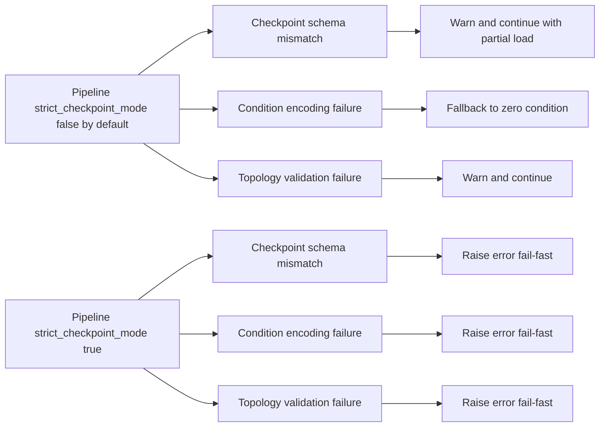
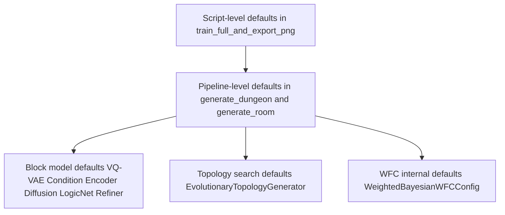

# Current Architecture

This document captures the current end-to-end architecture in code.
The original dated snapshot is archived at
`docs/archive/2026-q1/CURRENT_ARCHITECTURE_FULL_DRAWING_2026_03_25.md`.

## 1) Full System Architecture

```mermaid
flowchart TB
    %% =========================
    %% Entry points
    %% =========================
    U1[main.py legacy validation path]
    U2[gui_runner.py interactive path]
    U3[scripts/train_full_and_export_png.py run/export path]

    %% =========================
    %% Data / Assets
    %% =========================
    D0[Data/The Legend of Zelda Processed txt and dot]
    D1[checkpoints directory]

    %% =========================
    %% Core pipeline facade
    %% =========================
    CP[create_pipeline in src/pipeline/dungeon_pipeline.py]
    NP[NeuralSymbolicDungeonPipeline]

    U2 --> CP
    U3 --> CP
    CP --> NP
    D1 --> CP

    %% =========================
    %% Block 0
    %% =========================
    subgraph B0
        B0_label["Block 0 Data Adapter and Stitching Utilities"]
        B0A[VGLCParser and adapters in src/data_processing/data_adapter.py]
        B0B[DungeonStitcher in src/zelda_data/zelda_core.py]
    end

    D0 --> B0A

    %% =========================
    %% Block I
    %% =========================
    subgraph B1
        B1_label["Block I Evolutionary Topology Director"]
        B1A[generate_dungeon generate_topology flag]
        B1B[EvolutionaryTopologyGenerator]
        B1C[GraphGrammarExecutor]
        B1D[Tension and descriptor evaluator]
        B1E[validate_graph_topology]
        B1F[filter_virtual_nodes and get_physical_start_node]

        B1A --> B1B --> B1C --> B1D
        B1B --> B1E
        B1B --> B1F
    end

    NP --> B1A

    %% =========================
    %% Block II
    %% =========================
    subgraph B2
        B2_label["Block II Semantic VQ-VAE"]
        B2A[SemanticVQVAE encode decode]
        B2B[num_classes 44 codebook 512 latent_dim 64]
    end

    NP --> B2A
    B2A --> B2B

    %% =========================
    %% Block III
    %% =========================
    subgraph B3
        B3_label["Block III Dual-Stream Condition Encoder"]
        B3A[DualStreamConditionEncoder]
        B3B[LocalStreamEncoder boundary and neighbors]
        B3C[GlobalStreamEncoder graph GNN]
        B3D[GraphToGridCrossAttention]
        B3F[SpatialGraphConditioner]
        B3E[RoomTopologyConditioner]
    end

    NP --> B3A
    B3A --> B3B
    B3A --> B3C
    B3A --> B3D
    B3A --> B3F

    %% =========================
    %% Block IV
    %% =========================
    subgraph B4
        B4_label["Block IV Latent Diffusion"]
        B4A[LatentDiffusionModel]
        B4B[CFG cfg_scale plus conditional dropout]
        B4C[DDIM or DDPM sampling]
        B4D[Topology refinement mode none lightweight gat2]
        B4E[Latent boundary masking and inpaint]
    end

    NP --> B4A
    B4A --> B4B
    B4A --> B4C
    B4A --> B4D
    B4A --> B4E

    %% =========================
    %% Block V
    %% =========================
    subgraph B5
        B5_label["Block V LogicNet Guidance"]
        B5A[LogicNet differentiable constraints]
        B5B[GradientGuidance inside diffusion]
    end

    NP --> B5A
    B4A --> B5B
    B5A --> B5B

    %% =========================
    %% Block VI
    %% =========================
    subgraph B6
        B6_label["Block VI Symbolic Refiner"]
        B6A[SymbolicRefiner]
        B6B[Weighted Bayesian WFC]
        B6C[repair_room_with_feedback and local inpaint callbacks]
        B6D[max_repair_attempts 5 margin 2]
    end

    NP --> B6A
    B6A --> B6B
    B6A --> B6C
    B6A --> B6D

    %% =========================
    %% Block VII
    %% =========================
    subgraph B7
        B7_label["Block VII MAP-Elites Quality Diversity"]
        B7A[MAPElitesEvaluator]
        B7B[descriptor_mode hybrid tie_breaker quality_score in pipeline]
        B7C[advanced CVT archive optional]
    end

    NP --> B7A
    B7A --> B7B
    B7A --> B7C

    %% =========================
    %% Outputs
    %% =========================
    O1[RoomGenerationResult per room]
    O2[DungeonGenerationResult stitched grid rooms metrics]
    O3[Exporter outputs npy png txt ids txt vglc]

    B2A --> O1
    B3A --> O1
    B4A --> O1
    B5A --> O1
    B6A --> O1
    B7A --> O2
    B0B --> O2
    O2 --> O3

    U3 --> O3
```

## 2) Runtime Execution Flow (Single Dungeon Generation)

## 3) Strict Mode and Fallback Behavior

## 4) Effective Hyperparameter Layers (Current)

## 5) Component Index (Code Locations)

- Pipeline facade and orchestration: src/pipeline/dungeon_pipeline.py
- Topology evolution: src/generation/evolutionary_director.py
- VQ-VAE: src/core/vqvae.py
- Condition encoder: src/core/condition_encoder.py
- Diffusion: src/core/latent_diffusion.py
- LogicNet: src/core/logic_net.py
- Symbolic refiner and repair: src/core/symbolic_refiner.py
- Weighted Bayesian WFC: src/generation/weighted_bayesian_wfc.py
- MAP-Elites: src/simulation/map_elites.py
- Zelda data and stitching: src/zelda_data/zelda_core.py
- VGLC parsing and adapter: src/data_processing/data_adapter.py
- Export runner: scripts/train_full_and_export_png.py
