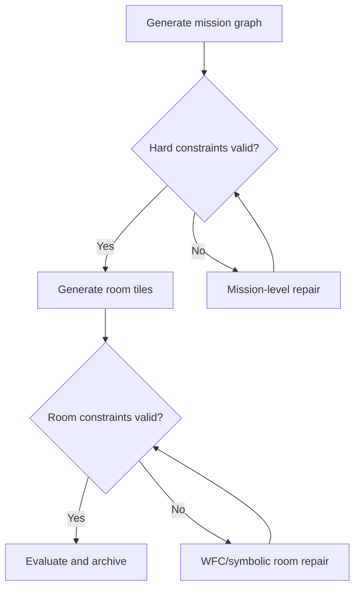

# SOTA Comparison, Architecture Audit, and Benchmark Protocol

Last updated: 2026-02-24

This is the research baseline for this repository:
- what is already implemented,
- where the remaining risks are,
- how to benchmark against prior work with quantitative evidence.

## 1. Implemented High-Impact Upgrades

### 1.1 Benchmark robustness outputs are now explicit and stable

`src/evaluation/benchmark_suite.py` now always reports robustness keys, even when `wfc_probe_samples=0`:
- `repair_rate`, `mean_total_repairs`, `mean_lock_key_repairs`, `mean_progression_repairs`, `mean_wave3_repairs`, `mean_repair_rounds`
- `wfc_probe_count`, `wfc_contradiction_rate`, `wfc_restart_rate`, `wfc_fallback_rate`
- `wfc_mean_contradictions`, `wfc_mean_backtracks`, `wfc_mean_restarts`
- `wfc_mean_zero_prob_resets`, `wfc_mean_fallback_fills`, `wfc_mean_kl_divergence`, `wfc_distribution_preserved_rate`

This removes report-shape drift and allows consistent downstream tables/plots.

### 1.2 Block-0 data/process audit is now integrated

Added:
- `audit_block0_dataset(...)` in `src/evaluation/benchmark_suite.py`
- `scripts/audit_block0_data.py`

`run_block_i_benchmark_from_scratch(...)` now includes a `data_audit` payload in the JSON summary (enabled by default, disable with `--no-data-audit`).

### 1.3 Requested calibration and ablation protocols are wired

Already present in code:
- VGLC-targeted rule scheduling calibration:
  - `calibrate_rule_weights_to_vglc(...)` in `src/evaluation/benchmark_suite.py`
- Fixed-seed ablation protocol with significance:
  - `scripts/run_ablation_study.py`
  - paired bootstrap confidence intervals
  - random-sign permutation p-values
  - Benjamini-Hochberg FDR-adjusted p-values
- Ablation matrix includes:
  - `FULL`, `NO_EVOLUTION`, `NO_WFC`, `NO_LOGIC`
  - VQ codebook sweep: `128`, `512`, `2048`
  - latent sampler: diffusion vs categorical
  - conditioning: with/without TPE
  - LogicNet guidance sweep

### 1.4 Next-action implementation (research-driven)

Implemented upgrades:
- WFC robustness probe now uses **partial-mask stress inputs** instead of fully observed room replay.
  - New benchmark controls:
    - `--wfc-probe-mask-ratios` (default `0.15,0.35,0.55`)
    - `--wfc-probe-no-preserve-critical`
  - New robustness outputs:
    - `wfc_mean_mask_ratio`, `wfc_mean_masked_tiles`
- Block-I benchmark now supports **reference-aligned room budgets** and biased room-count sampling to reduce topology-size underfitting.
  - New controls:
    - `--no-align-rooms-to-reference`
    - `--room-budget-cap`
    - `--room-count-bias`
- Rule-weight calibration now includes explicit pressure from `path_length` and `num_nodes` errors (not only 4D descriptor mismatch).
- Ablation runner now supports a tractable research loop:
  - `--quick` profile
  - `--max-runtime-sec` for partial-yet-exported runs.
- Ablation metrics semantics are now explicit:
  - `confusion_ratio` = CBS path length / optimal path length (when both succeed)
  - `confusion_index` = CBS revisit-based cognitive confusion metric

## 2. Quantitative Literature Comparison (Numbers, Not Only Ideas)

| Work | Quantitative finding | Relevance to this repo |
|---|---|---|
| PCGRL (Khalifa et al., 2020) | RL methods outperform prior methods in `6/8` tested game domains; training reports include runs to `100M` environment frames | Supports RL-based baselines for Block II-IV controllability/diversity comparisons |
| CVT-MAP-Elites (Vassiliades et al., 2017) | Demonstrates archive scaling in descriptor spaces up to `1000` dimensions; explains why fixed-grid MAP-Elites becomes intractable (example memory estimate `4096 TB`) | Supports moving production QD from rigid grid archives to centroid-based archives |
| CMA-ME (Fontaine et al., 2020) | Reports performance gains that "more than double" prior best QD methods on benchmark tasks | Supports emitter-based QD upgrades beyond plain MAP-Elites |
| VGLC (Summerville et al., 2016) | Corpus contains `428` levels from `12` games | Establishes dataset-scale context for external validity |
| Zelda locked-door generation (Mota et al., 2021) | User study with `70` players; most generated dungeons completed in `< 1 minute` | Confirms expected evaluation standard includes player study, not solver-only metrics |

Notes:
- The ESWA paper statistics above are taken from abstract/indexed summaries; treat them as reported values and verify in full text for final thesis tables.

## 3. Benchmark and Assessment Standards for Generated Levels

For thesis-grade assessment, use all three layers:

1. Structural correctness:
   - start/goal validity
   - connectivity and path existence
   - progression constraints (key/lock/item/token ordering)
2. Distributional fidelity and robustness:
   - tile-prior KL
   - repair rate
   - WFC contradiction/restart/fallback rates
3. Behavioral diversity and utility:
   - novelty/diversity
   - confusion ratio (CBS vs optimal)
   - path optimality
   - graph-edit-distance proxy vs references

Current implementation coverage:
- `src/evaluation/benchmark_suite.py`: structural + robustness + expressive-range metrics
- `scripts/run_ablation_study.py`: component-necessity and significance protocol

## 4. Block-0 Data Audit (Repository Ground Truth)

Run:

```bash
python scripts/audit_block0_data.py --pretty --output results/block0_audit_latest.json
```

Latest local output (`results/block0_audit_latest.json`):
- `txt_file_count`: `20`
- `dot_file_count`: `18`
- `reference_room_count`: `450`
- `reference_graph_count`: `18`
- `room_shape_histogram`: `16x11 -> 450`
- graph nodes: mean `29.5`, min `12`, max `66`, std `13.93`
- graph edges: mean `64.83`, min `22`, max `160`, std `34.45`
- graph completeness in references:
  - `has_start_rate`: `1.0`
  - `has_goal_rate`: `1.0`
  - `path_exists_rate`: `1.0`

## 5. Architecture (Block 0 to VII)

### 5.1 End-to-end pipeline

```mermaid
flowchart LR
  B0[Block 0 Data Adapter<br/>VGLC txt + DOT parsing]
  B1[Block I Mission Graph Generator<br/>Grammar + Evolution/QD]
  B2[Block II VQ-VAE<br/>Discrete latent space]
  B3[Block III Condition Encoder<br/>Neighbors + graph + TPE]
  B4[Block IV Latent Generator<br/>Diffusion or categorical]
  B5[Block V Logic Guidance<br/>Differentiable solvability signal]
  B6[Block VI Symbolic Repair<br/>WFC / local repair]
  B7[Block VII Evaluation/QD<br/>Benchmark suite + MAP-Elites]
  OUT[Playable dungeon + report]

  B0 --> B1 --> B2 --> B3 --> B4 --> B5 --> B6 --> B7 --> OUT
```



### 5.2 Control and repair flow



## 6. Block I Deep Dive

### 6.1 Why search-based mission generation is chosen

Search-based topology generation is preferred because it can jointly optimize:
- strict progression validity,
- target pacing/tension curves,
- descriptor-space diversity.

Constructive-only generators are typically faster but weaker on multi-objective controllability.

### 6.2 Hard vs soft constraints

Hard constraints:
- anchor nodes (`START`, `GOAL`)
- reachability and key/lock/item/token pre-gate ordering
- start-to-goal solvability

Soft constraints:
- pacing-curve fit
- branching/cycle richness
- leniency/topology profile targets
- pedagogical ordering preferences

### 6.3 Repair location

- Mission-level repair: inside `MissionGrammar.generate()`
- Tile-level repair: Block VI (`SymbolicRefiner` and WFC diagnostics path)

## 7. Block II-IV Deep Dive (Room Generation)

### 7.1 How topology information is translated into rooms

`src/pipeline/dungeon_pipeline.py`:
1. Encode mission graph into node/edge features (+ optional TPE).
2. Build per-room conditioning using neighborhood + graph context.
3. Sample room latent (`diffusion` or `categorical` path).
4. Decode latent to tile logits/grid.
5. Apply symbolic repair if enabled, then stitch all rooms.

### 7.2 Current strengths

- Supports both diffusion and categorical latent generation.
- Supports conditioning ablation with/without TPE.
- Supports room-level repair-rate measurement.

### 7.3 Current gap and best next improvement

Gap:
- No explicit room-maze objective in primary fitness.

Best next improvement:
- Add room-level maze descriptors (corridor entropy, junction density, dead-end ratio) and include them in QD descriptors/fitness.

## 8. Cognitive State and Persona Semantics

Source: `src/simulation/cognitive_bounded_search.py`

Decision utility:
- `U(a) = alpha * goal_progress + beta * info_gain - gamma * risk`

Personas are defined by measurable parameters:
- memory: `memory_capacity`, `memory_decay_rate`, `decay_rate`
- perception: `vision_radius`, `vision_cone`, `vision_accuracy`
- strategy: heuristic weights + `(alpha, beta, gamma)`
- decision style: `satisficing_threshold`, `random_tiebreaker`

Examples from current configs:
- `speedrunner`: high goal weight (`alpha=0.8`), high vision, low randomness
- `forgetful`: lower memory capacity, faster decay, higher randomness
- `cautious`: higher risk weight (`gamma=0.3`), narrower vision cone
- `greedy`: no memory decay baseline (`memory_decay_rate=1.0`) for ablation of decay effects

## 9. Should Evolution Be Added at the End?

Recommendation:
- Keep evolution primarily in Block I for topology correctness and progression structure.
- Optional end-stage evolution can be used only for room-style diversification after mission constraints are frozen.

In short: evolution-at-end is optional; repair and correctness should stay before final evaluation.

## 10. Reproducible Commands

Block-I benchmark + calibration + WFC probe:

```bash
python -m src.evaluation.benchmark_suite \
  --num-generated 30 \
  --seed 42 \
  --calibrate-rule-schedule \
  --calibration-iterations 5 \
  --calibration-sample-size 12 \
  --wfc-probe-samples 32 \
  --pretty \
  --output results/block_i_benchmark.json
```

Ablation protocol:

```bash
python scripts/run_ablation_study.py \
  --num-samples 50 \
  --seed 42 \
  --output results/ablation
```

Kaggle T4 x2 ablation preset:

```bash
python scripts/run_ablation_study.py \
  --kaggle-t4x2 \
  --output results/ablation_kaggle
```

Matched-budget method comparison (RANDOM/ES/GA/MAP_ELITES/FULL):

```bash
python scripts/run_matched_budget_topology_benchmark.py \
  --methods RANDOM,ES,GA,MAP_ELITES,FULL \
  --num-samples 10 \
  --seed 42 \
  --eval-budget 512 \
  --output results/matched_budget
```

## 11. Current Priority Roadmap

1. Move production QD archive to CVT/CMA-emitter configuration.
2. Add explicit room-maze descriptors to Block II-IV objectives.
3. Expand fixed-seed ablations to trained checkpoints for final thesis tables.
4. Add player-study or stronger cognitive-agent validation beyond solver pass/fail.

## References

- PCGRL: https://arxiv.org/abs/2001.09212
- CVT-MAP-Elites: https://arxiv.org/abs/1610.05729
- CMA-ME: https://arxiv.org/abs/1912.02400
- VGLC paper: https://arxiv.org/abs/1606.07487
- VGLC repository: https://github.com/TheVGLC/TheVGLC
- Mission-space paradigm (Dormans/Bakkes): https://doi.org/10.1109/TCIAIG.2010.2067210
- WFC as constraint solving (Karth & Smith): https://doi.org/10.1609/aiide.v13i1.12899
- Zelda locked-door generation (ESWA): https://www.sciencedirect.com/science/article/pii/S0957417421004504
