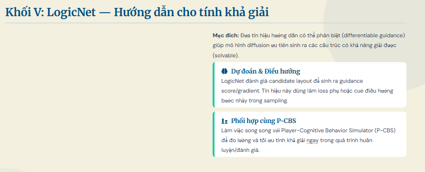

# Corrected LogicNet vs No-LogicNet Evidence

Status: this supersedes `results/logicnet_vs_no_logic_evidence_20260508/logicnet_vs_no_logic_evidence.md`.

## What Was Wrong

- The earlier report reused separate result folders that did not record checkpoint provenance.
- The current trained checkpoint in `outputs/full_i_to_vii_qd` was newer than those prior result folders.
- The earlier conclusion that LogicNet reduced repair/fidelity error is not reproduced when all component checkpoints are pinned.

## Rerun

- Output: `results\logicnet_vs_no_logic_explicit_ckpt_quick_20260508`
- LogicNet condition: `FULL`, `logic_guidance_scale=1.0`
- No-LogicNet condition: `NO_LOGIC`, `logic_guidance_scale=0.0`
- Paired seeds: 20260508, 20260509
- Checkpoints pinned:
  - `outputs/full_i_to_vii_qd/checkpoints/vqvae_pretrained.pth`
  - `outputs/full_i_to_vii_qd/checkpoints/best_model.pth` for diffusion
  - `outputs/full_i_to_vii_qd/checkpoints/best_model.pth` for condition encoder
  - `outputs/full_i_to_vii_qd/checkpoints/best_logic_model.pth` for LogicNet

Command:

```powershell
.\.venv-1\Scripts\python.exe scripts\run_ablation_study.py --output results\logicnet_vs_no_logic_explicit_ckpt_quick_20260508 --data-root Data\The Legend of Zelda --configs FULL,NO_LOGIC --num-samples 2 --seed 20260508 --num-rooms 8 --diffusion-steps 6 --evolution-population 8 --evolution-generations 4 --cbs-timeout 15000 --max-runtime-sec 900 --vqvae-checkpoint outputs\full_i_to_vii_qd\checkpoints\vqvae_pretrained.pth --diffusion-checkpoint outputs\full_i_to_vii_qd\checkpoints\best_model.pth --logic-net-checkpoint outputs\full_i_to_vii_qd\checkpoints\best_logic_model.pth --condition-encoder-checkpoint outputs\full_i_to_vii_qd\checkpoints\best_model.pth --verbose
```

## Paired Metrics

| metric | direction | n_pairs | logic_mean | no_logic_mean | delta_logic_minus_no_logic | relative_delta_pct_of_no_logic | logic_wins | ties | logic_losses |
| --- | --- | --- | --- | --- | --- | --- | --- | --- | --- |
| success | higher | 2 | 1 | 1 | 0 | 0 | 0 | 2 | 0 |
| solvable | higher | 2 | 0.5 | 0.5 | 0 | 0 | 0 | 2 | 0 |
| path_optimal | higher | 2 | 0.326446 | 0.326446 | 0 | 0 | 0 | 2 | 0 |
| tile_prior_kl | lower | 2 | 1.33007 | 1.33008 | -5.14228e-06 | -0.000386614 | 1 | 0 | 1 |
| reconstruction_error | lower | 2 | 0.0994318 | 0.0994318 | 0 | 0 | 0 | 2 | 0 |
| room_repair_rate | lower | 2 | 0.75 | 0.75 | 0 | 0 | 0 | 2 | 0 |
| tiles_repaired | lower | 2 | 110.5 | 110.5 | 0 | 0 | 1 | 0 | 1 |
| topology_preservation_score | higher | 2 | 0.436439 | 0.436439 | 0 | 0 | 0 | 2 | 0 |
| generation_time_sec | lower | 2 | 51.6944 | 32.3338 | 19.3605 | 59.8771 | 0 | 0 | 2 |

## Guidance Probe

- LogicNet was loaded and guidance was called: `12` calls.
- Nonzero calls above `1e-8`: `4`.
- Maximum returned guidance norm: `0.000151742`.
- Interpretation: the path is wired, but the scale-1 runtime gradient is extremely small, so it does not materially move the decoded grid in this quick matched run.

## Conclusion

For the current explicit checkpoint rerun, there is no evidence to use inference-time LogicNet guidance at `logic_guidance_scale=1.0` as a default. The metrics are identical or near-identical, while LogicNet adds runtime cost.

Keep `generation.logic_guidance_scale=0.0` for final generation unless you run a calibrated guidance-scale sweep and show a real gain. LogicNet can still be discussed as a training-time auxiliary/teacher signal because the training log shows validation logic loss improving, but that is a different claim from runtime guidance helping generation.

## Files

- `ablation_raw.csv`
- `ablation_summary.csv`
- `ablation_significance.csv`
- `logic_guidance_dungeon_probe.json`
- `logic_guidance_call_probe.json`
- `corrected_paired_metric_summary.csv`
- `corrected_logicnet_vs_no_logic_report.json`
